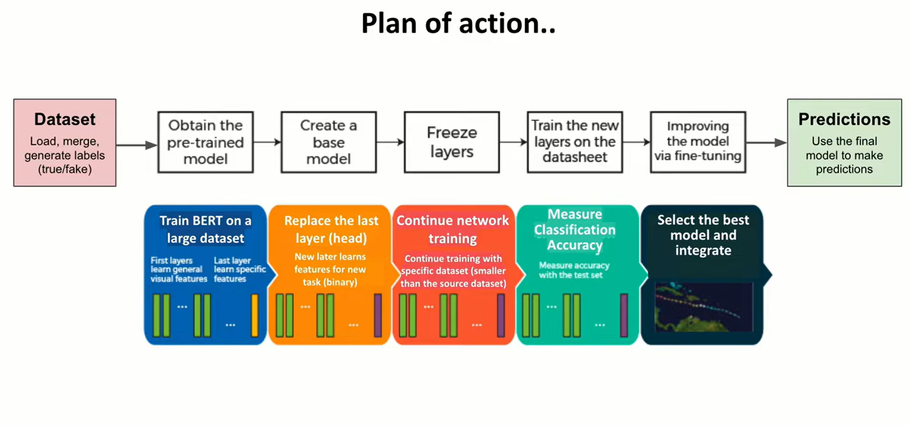
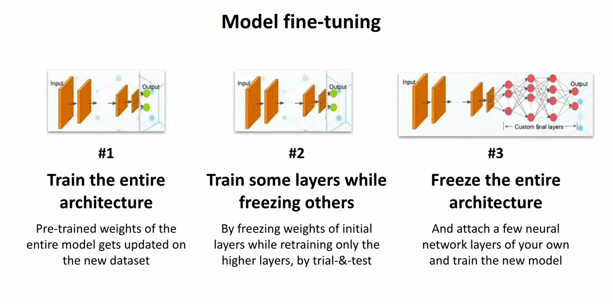
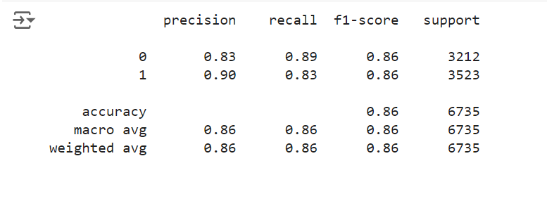

# Fake News Detection using Bert
 
<b>Project Overview</b>
This project focuses on detecting fake news using the BERT (Bidirectional Encoder Representations from Transformers) model. The primary goal is to build a robust machine learning model that can accurately classify news articles as either true or fake. The project involves several stages, including data preprocessing, model training, and evaluation.
 

# Introduction
The proliferation of fake news has become a significant issue in today's digital age. Fake news can mislead the public, influence political decisions, and create social unrest. This project aims to address this problem by leveraging the BERT model to detect fake news with high accuracy.
 

# Dataset Description
 
The dataset used in this project consists of two CSV files: one containing true news articles and the other containing fake news articles. Each article includes the following attributes:
 

The dataset is availabe on [Kaggle](https://www.kaggle.com/datasets/clmentbisaillon/fake-and-real-news-dataset) 

<b>Title: </b>The headline of the news article. 
<b>Text: </b>The main content of the news article. 
<b>Subject:</b> The category or subject of the news article. 
<b>Date: </b>The publication date of the news article. 
<b>Target: </b>A label indicating whether the news is true or fake. 

The true and fake news articles are merged into a single DataFrame, and a new column, label, is created to represent the target labels numerically (0 for true and 1 for fake).
 

# Plan Of Action
 

 

# Data Preprocessing
 
Data preprocessing is a crucial step in preparing the dataset for model training. The following steps were performed:
 
<b>Label Encoding:</b> The target labels (True/Fake) were converted to numerical values (0/1). 
<b>Data Balancing: </b>The dataset was checked for balance between true and fake news articles. 
<b>Train-Test Split:</b> The dataset was split into training, validation, and test sets in a 70:15:15 ratio. 
<b>Tokenization:</b> The BERT tokenizer was used to tokenize and encode the text data into a format suitable for the BERT model. 

# Model Architecture
 
The BERT model was fine-tuned for the task of fake news detection. The architecture includes:
 
<b>BERT Base Model: </b>Pre-trained BERT model (bert-base-uncased) from HuggingFace. 
<b>Dropout Layer: </b>To prevent overfitting. 
<b>ReLU Activation: </b>For non-linearity. 
<b>Fully Connected Layers:</b> Two dense layers for classification. 
<b>Softmax Activation: </b>For outputting probabilities of the classes. 

# Training and Evaluation 
The model was trained using the AdamW optimizer and a negative log-likelihood loss function. The training process involved:
 
<b>Freezing BERT Layers: </b>Only the final layers were fine-tuned to speed up training and prevent overfitting. 
<b>Training Loop: </b>The model was trained for a specified number of epochs, with periodic evaluation on the validation set. 
<b>Evaluation Metrics: </b>The model's performance was evaluated using precision, recall, f1-score, and accuracy. 

# Results 
The model achieved an accuracy of 86% on the test set. The detailed classification report is as follows: 

 
The model demonstrated a balanced performance across both classes, indicating its effectiveness in detecting fake news. 

# Web Application
 

 

# Conclusion
 
This project successfully developed a BERT-based model for fake news detection with high accuracy. The model can be further improved by:
 
Increasing Training Data: More diverse and larger datasets can enhance model performance. 
Hyperparameter Tuning: Fine-tuning hyperparameters for optimal performance. 
Advanced Architectures: Exploring more advanced transformer architectures or ensemble methods. 